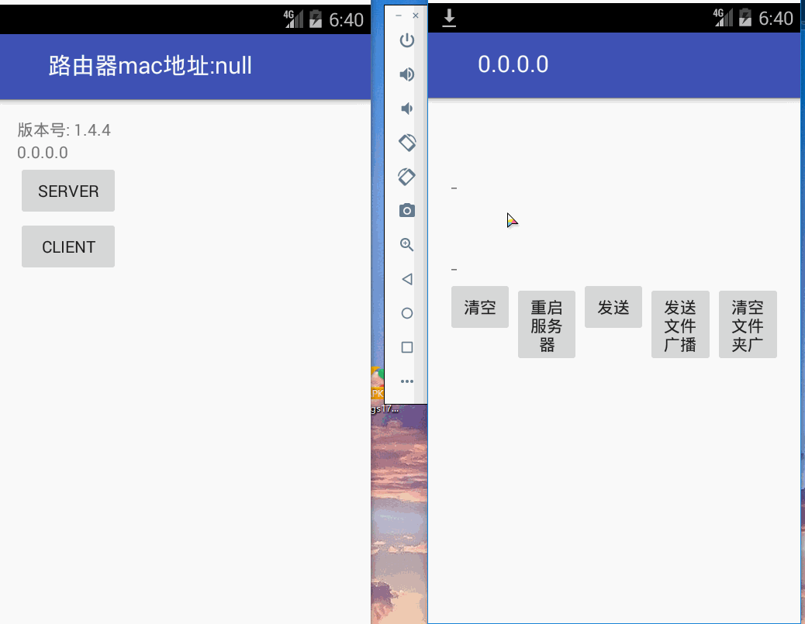

# android_socket
### 文件传输流程:
1. 通过局域网广播的方式通知其他客户端服务器ip地址和要发送的文件列表
2. 客户端收到广播后,主动连接服务器传入需要的文件名
3. 通信协议为子节流的前4个字节表示数据长度,后面紧跟要发的内容,发送时都是先发内容长度再发具体内容,接收端也是一样
### 项目特性:
1. 支持多个文件传输,用了任务调度框架[priority-jobqueue](https://github.com/yigit/android-priority-jobqueue "priority-jobqueue")
2. 对socket进行了一些封装,提供一系列回调,连接成功,文件进度,出现异常等
3. 传输过程中socket超时,支持自动重连
4. 局域网传输文件,支持断点续传
5. 交互协议通过json格式进行通信,通用型更强
6. 支持一对多传输

#### *因为模拟器不能发局域网广播,只能手动输入ip和需要的文件名*
